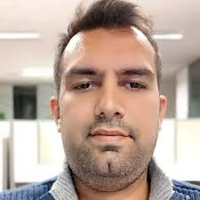
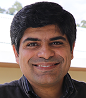
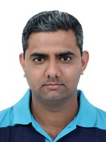
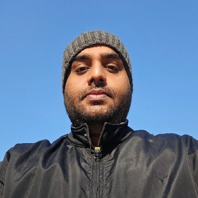
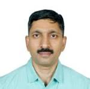

Welcome to our Special Session on "Consciousness and LLMs: A Synergistic Approach to Intelligence", organized by  IIT MANDI
@<a href="https://iksmha.iitmandi.ac.in/mbcc/2025/"><b>MBCC</b></a> and BharatGen.

The integration of consciousness studies and Large Language Models (LLMs) offers a unique opportunity to advance our understanding of intelligence. This special session serves as a platform to bridge cutting-edge advancements in AI with the mysteries of human cognition, fostering interdisciplinary collaboration between researchers, technologists, and philosophers.

This session will cover a range of topics, including:

+ Examining curiosity as a fundamental aspect of conscious awareness and its impact on intelligence and learning in LLM's. 
+ Investigating how intuitive decisions, emotional understanding, and cultural connections influence the development of conscious-like behaviors in LLM systems. 
+ Modeling curiosity-driven problem-solving in AI to enable systems that emulate human-like curiosity and adaptability.
+ Exploring novel methodologies to integrate consciousness concepts into AI, such as Reinforcement Learning with Human Feedback (RLHF) and attention mechanisms inspired by cognitive neuroscience. 
+ Using LLMs and neural-symbolic approaches to model self-awareness, reflection, and meta-cognition. 
+ Leveraging AI tools to simulate and analyze states of consciousness, enabling interdisciplinary studies at the interface of neuroscience, philosophy, and AI.
+ Highlighting the limitations of current AI models in capturing the depth of human cultural, emotional, and cognitive diversity. 
+ Proposing innovative frameworks to enable LLMs to better model nuanced emotional states, cross-cultural perspectives, and symbolic reasoning tied to consciousness. 
+ Incorporating consciousness-aware feedback mechanisms to enhance the authenticity of human-AI interactions.
+ Examining how LLMs and NLP tools are reshaping our understanding of intelligence and consciousness in humans and machines. 
+ Envisioning the role of generative AI in advancing studies on self-awareness, meta-awareness, and cognitive processes. 
+ Investigating how AI systems can evolve beyond static reasoning models to embrace dynamic, consciousness-inspired frameworks for problem-solving and adaptation.

We invite submissions of extended abstracts and full papers on the themes of this session and look forward to engaging with a vibrant community of scholars and innovators at MBCC 2025. Together, let us redefine the boundaries of intelligence and consciousness!

---
## **Important Dates** {#dates}

| Submission Deadline  | **March 10, 2025** |
| Final Decisions  | **March 31, 2025** |
| Camera Ready  | **April 15, 2025** |
| Workshop Date | **June 4-7, 2025** | 

---

## **Keynote Speakers** {#speakers}

    <figure>
        
        <b> <a href="https://sites.google.com/cs.washington.edu/william-agnew/home">Ganesh Ramakrishnan</a>
         Professor Indian Institute of Technology, Bomday</b>
    </figure>

<a href="https://beerys.github.io/"><b>Dr. Ganesh Ramakrishnan</b></a> is a leading researcher in Artificial Intelligence (AI), Machine Learning, and Natural Language Processing (NLP), will deliver a keynote at MBCC 2025. Known for his pioneering work on BharatGen, the first government-funded multimodal LLM project for Indian languages, and Udaan, an innovative translation ecosystem, Dr. Ramakrishnan bridges AI with cognitive science to address real-world challenges.
His keynote will explore the synergy between AI advancements and consciousness studies, offering transformative insights into how technology can deepen our understanding of human cognition and enhance cognitive wellness.

  

## **Organizers** {#organizers}

<figure>
    
    <b> <a href="https://candiceschumann.com/">Rohit Saluja</a>
     Assistant Professor Indian Institute of Technology, Mandi</b>
</figure>

<figure>
    
    <b> <a href="https://candiceschumann.com/">Varun Dutt</a>
     Professor Indian Institute of Technology, Mandi</b>
</figure>

<figure>
    
    <b> <a href="https://candiceschumann.com/">Arnav Bhavsar</a>
     Professor Indian Institute of Technology, Mandi</b>
</figure>

---

## **Contact** {#contact}
Contact the organizers at **[rohit@iitmandi.ac.in](mailto:rohit@iitmandi.ac.in)**

## **Registration** {#contact}
**[Fee and Other Details](https://iksmha.iitmandi.ac.in/mbcc/2025/fees.php)**

---
## **Call for Papers** {#call}

We welcome contributions on topics including, but not limited to:

+ Exploring methodologies to integrate consciousness principles into large language models, enhancing self-awareness and reflective reasoning.
+ Incorporating novel techniques, such as RLHF, to align LLMs with conscious cognition and introspection.
+ Investigating the role of curiosity in driving intuitive decisions, emotional understanding, and cultural adaptability in consciousness-enhanced LLMs.
+ Addressing ethical complexities in aligning consciousness-driven LLMs with human values, mitigating biases, and ensuring accountability.
+ Bridging philosophical insights from ancient traditions with modern advancements in LLM-based consciousness studies.
+ Developing datasets and benchmarks to study consciousness-driven cognition, emotional reasoning, and contextual understanding in LLMs.
+ Enabling LLMs to simulate human cognition by incorporating cultural, emotional, and contextual awareness into consciousness-inspired models.
+ Creating frameworks for privacy-preserving, transparent, and ethically aligned LLMs with a focus on conscious intelligence.
+ Investigating the implications of LLMs in redefining intelligence studies, emphasizing consciousness and cognitive synergies.

Submissions are invited for full-length papers based on original work. Full-length papers should follow the Springer template in [latex](https://resource-cms.springernature.com/springer-cms/rest/v1/content/19338728/data/v1) or [Microsoft Word](https://resource-cms.springernature.com/springer-cms/rest/v1/content/19338734/data/v1) and should be limited to 8 to 12 pages. The accepted full-length papers, if accepted, will be published as proceedings with a publisher. 

Submissions are also invited for extended abstracts, which, if accepted, will be invited for poster presentations during the conference and will be published in the web proceedings on the conference webpage. Extended abstracts should be limited to a maximum of 1000 words, including two figures and two tables (references are not counted in the word limit). In both extended abstracts and full-length papers, excluding references and citations, the amount of similarity to published sources should not be more than 15% and similarity to a single source should not be more than 4%.

## **Session Chairs** {#chairs}

<figure>
    
    <b> <a href="https://candiceschumann.com/">Rohit Saluja</a>
     Assistant Professor Indian Institute of Technology, Mandi</b>
      Session Chair
</figure>

<figure>
    
    <b> <a href="https://candiceschumann.com/">Manikandan Ravikiran</a>
     Research Scientist R&D Centre, Hitachi India</b>
     Session Co-Chair
</figure>

<figure>
    
    <b> <a href="https://candiceschumann.com/">Ananth Ganesh</a>
     Deputy GM R&D Centre, Hitachi India</b>
     Session Co-Chair
</figure>

