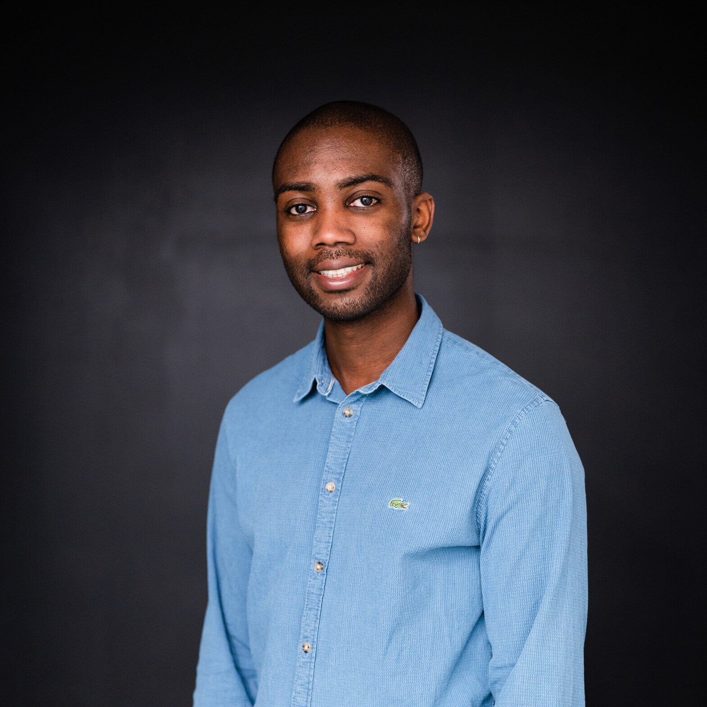

Welcome to our **Special Session on Consciousness and LLMs**!

Welcome to our Special Session on "Consciousness and LLMs: A Synergistic Approach to Intelligence"!

The integration of consciousness studies and Large Language Models (LLMs) offers a unique opportunity to advance our understanding of intelligence. This special session serves as a platform to bridge cutting-edge advancements in AI with the mysteries of human cognition, fostering interdisciplinary collaboration between researchers, technologists, and philosophers.

This session will cover a range of topics, including:

+ The role of curiosity in intelligence: How intuitive decisions, emotional understanding, and cultural connections shape consciousness and drive transformative innovation.
+ Advancing AI tools for consciousness studies: Exploring methodologies and techniques to integrate concepts of consciousness into AI development, such as Reinforcement Learning with Human Feedback (RLHF).
+ Ethical challenges in AI development: Addressing the complexities of aligning AI systems with human values, including issues related to bias, transparency, and accountability.
+ Bridging ancient wisdom with modern technologies: Connecting philosophical insights and cognitive practices with contemporary advancements in AI to foster cognitive wellness.
+ Cultural and emotional nuances in LLMs: Understanding the limitations of current models and proposing frameworks to capture deeper human-like cognition.
+ The future of intelligence studies in the era of Generative AI: Examining how LLMs and Natural Language Processing (NLP) tools are reshaping our approaches to intelligence research.
+ Post-session, we aim to publish a white paper summarizing the key discussions and insights (with participant permissions). Additionally, we plan to create a community platform on Discord (or a similar space) to facilitate ongoing collaboration and knowledge-sharing among researchers and practitioners.

We invite submissions of extended abstracts and full papers on the themes of this session and look forward to engaging with a vibrant community of scholars and innovators at MBCC 2025. Together, let us redefine the boundaries of intelligence and consciousness!

---
## **Important Dates** {#dates}

| Submission Deadline  | **March 10, 2025** |
| Final Decisions  | **March 31, 2025** |
| Camera Ready  | **April 15, 2025** |
| Workshop Date | **June 4-7, 2025** | 

---

## **Keynote Speakers** {#speakers}

    <figure>
        
        <b> <a href="https://sites.google.com/cs.washington.edu/william-agnew/home">Ganesh Ramakrishnan</a>
         Professor Indian Institute of Technology, Bombday</b>
    </figure>

<a href="https://beerys.github.io/"><b>Dr. Ganesh Ramakrishnan</b></a> is a leading researcher in Artificial Intelligence (AI), Machine Learning, and Natural Language Processing (NLP), will deliver a keynote at MBCC 2025. Known for his pioneering work on BharatGen, the first government-funded multimodal LLM project for Indian languages, and Udaan, an innovative translation ecosystem, Dr. Ramakrishnan bridges AI with cognitive science to address real-world challenges.
His keynote will explore the synergy between AI advancements and consciousness studies, offering transformative insights into how technology can deepen our understanding of human cognition and enhance cognitive wellness.

  

## **Organizers** {#organizers}

<figure>
    
    <b> <a href="https://candiceschumann.com/">Rohit Saluja</a>
     Assistant Profesoor Indian Institute of Technology</b>
</figure>

<figure>
    
    <b> <a href="https://hazirbas.com/">Caner Hazirbas (He/Him)</a>
     Research Scientist Meta AI</b>
</figure>

<figure>
    
    <b> <a href="https://www.cs.princeton.edu/~olgarus/">Olga Russakovsky (She/Her)</a>
     Associate Professor, CS    Princeton</b>
</figure>

<figure>
    
    <b> <a href="https://www.cs.princeton.edu/~vr23/">Vikram V. Ramaswamy (He/They)</a>
     Lecturer, CS    Princeton</b>
</figure>

<figure>
    
    <b> <a href="https://ai.sony/people/Jerone-Andrews/">Jerone Andrews (He/Him)</a>
     Research Scientist Sony AI</b>
</figure>

<figure>
    
    <b> <a href="https://ai.sony/people/Alice-Xiang/">Alice Xiang (She/Her)</a>
     Global Head of AI Ethics Sony AI</b>
</figure>

<figure>
    
    <b> <a href="https://www.linkedin.com/in/susanna-ricco/">Susanna Ricco (She/Her)</a>
     Research Engineer Google Research</b>
</figure>

<figure>
    
    <b> <a href="https://www.linkedin.com/in/courtney-heldreth-phd-3962b329/">Courtney Heldreth (She/Her)</a>
     UX Researcher Google Research</b>
</figure>

<figure>
    
    <b> <a href="">Biao Wang (He/Him)</a>
     Associate Product Manager Google Research</b>
</figure>

<figure>
    
    <b> <a href="https://cristiancanton.github.io/">Cristian Canton Ferrer (He/Him)</a>
     Head of GenAI Trust & Safety Meta AI</b>
</figure>

<figure>
    
    <b> <a href="https://www.linkedin.com/in/jessholbrook/">Jess Holbrook (He/Him)</a>
     Director and Principal Researcher, GenAI Meta AI</b>
</figure>

---
## **Contact** {#contact}
Contact the organizers at **[responsibledata@googlegroups.com](mailto:responsibledata@googlegroups.com)**

---
## ~~**Call for Papers**~~ {#call}

We welcome contributions on topics including, but not limited to:

+ Advancing AI for Consciousness Studies
+ Novel methodologies for integrating consciousness concepts into AI models, including techniques such as Reinforcement Learning with Human Feedback (RLHF).
+ The Role of Curiosity in Intelligence
+ Investigations into how curiosity drives intuitive decisions, emotional understanding, and cultural connections in human and artificial cognition.
+ Ethical Challenges in AI Development
+ Addressing the ethical complexities in aligning LLMs with human values, mitigating bias, and ensuring transparency and accountability.
+ Bridging Ancient Wisdom with Modern Technologies
+ Interdisciplinary approaches that connect ancient philosophical insights and practices with contemporary AI advancements.
+ Cultural and Emotional Nuances in AI
+ Datsets and Benchmarks to study conciousness in LLM's and its allied areas 
+ Exploring how LLMs can better simulate human cognition by incorporating cultural, emotional, and contextual understanding.
+ Responsible AI for Generative Models
+ Frameworks for developing responsible datasets, addressing privacy concerns, and improving transparency for AI systems.
+ Intelligence Studies in the Generative AI Era
+ Theoretical and practical implications of using LLMs and NLP tools to reshape how we study intelligence.

Submit your extended abstracts through [OpenReview](https://openreview.net/group?id=thecvf.com/CVPR/2024/Workshop/Responsible_Data).
